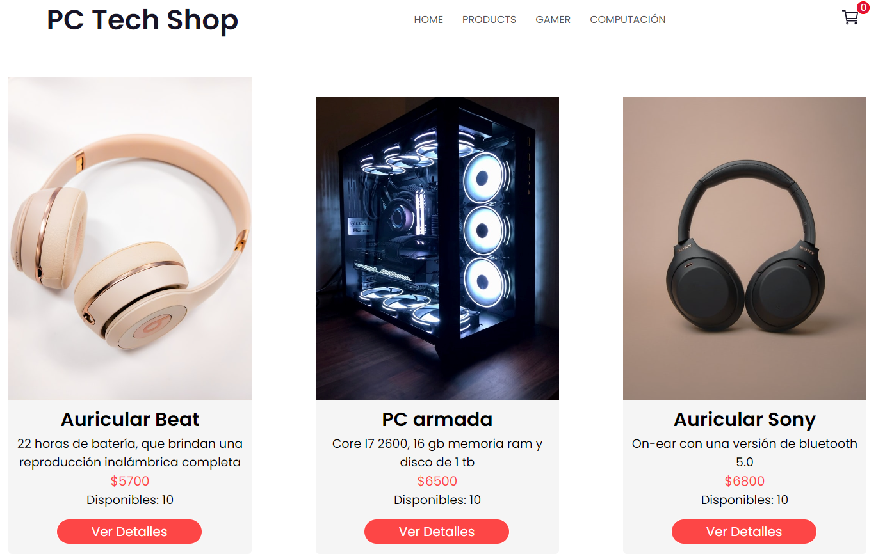
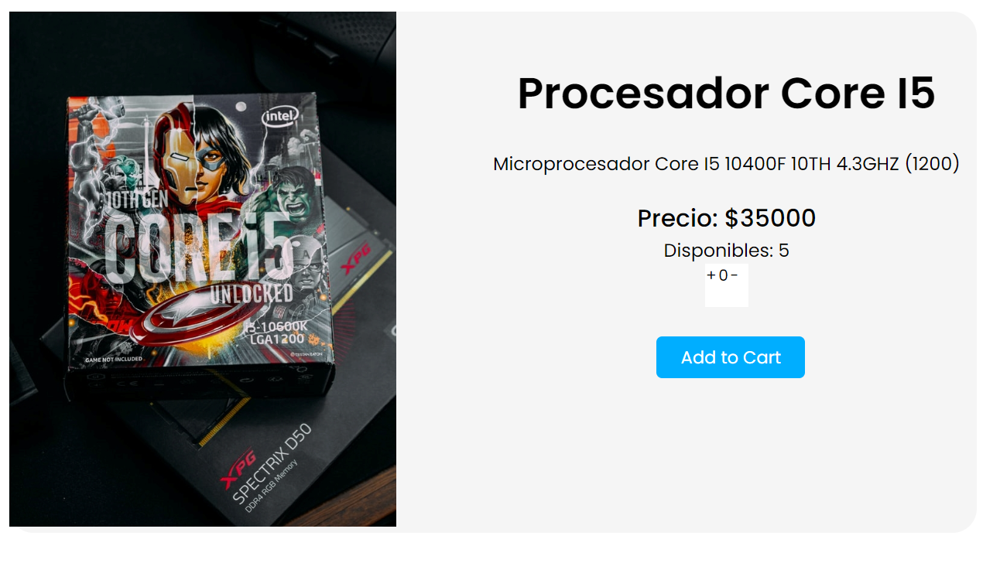
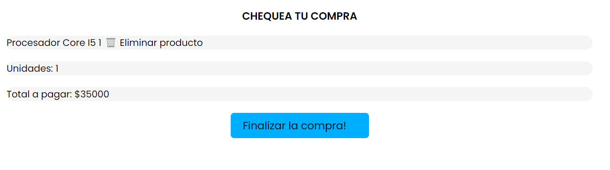

PC TECH SHOP

Ecommerce de componentes de computadora

Descripción

Ecommerce creado con React.js mediante Vite. Y se utilizará Firebase como back. El mismo contiente contiene dos categorias de productos, Computer y Gamer. Se utilizó CSS puro para los estilos de este proyecto. 

Para poder desplegar el proyecto realizar el "npm install" en la terminal para poder descargar librerias y posteriormente "npm run dev" para poder desplegarlo.  

Proyecto hecho para el curso de React JS de CoderHouse.

Screenshots

